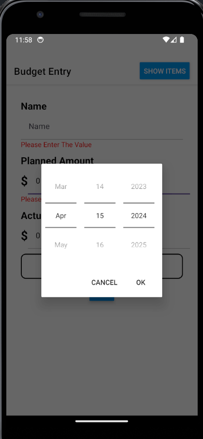
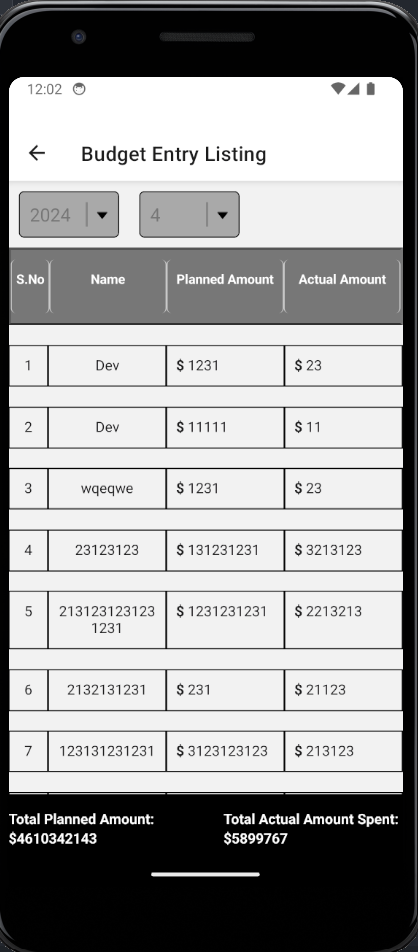

# Billing App

This is a Billing app to record all the Records of the Expenditure done.
The Data is stored in AsyncStorage and we are using redux to provide data to all the components.

To Start the application first open the terminal--
in terminal enter to the billing app folder using 
> cd billing-app

after that we will install all the modules required for the project to install them write-
> npm install

after installing the node_modules we can successfully run our application
to run the application we will write 
> npm start

Now our application is started to view the application on mobile a QR is provided with expo app in mobile we can view the application and use it but if we want to run on the android studio or XCode 
we can press a or i to run on android and ios emulators.

## Application Screen Shots

Home Page: Budget Entry

Home Page: Error Resposnes When Not Feild not Filled

Home Page: Setting the date for the entry

Budget Entry Listing:
Home Page: 

