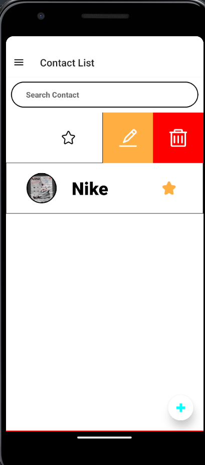

# Contact Application

This is a Contact Application where we can store, view, like, delete and update our contact list.
We are using Sqlite for our localDatabase for the application.

Drawer Navigation is used to switch between All contacts and Faviorite contacts.

To Start the application we have to perform various steps--
First we have to go to the required Directory using-
> cd contact_application

after that we have to install node_modules to install node_modules we write-
> npm i

Now we are ready to start the Application using-
> npm start

Now our application is started to view the application on mobile devices we can use expo app and scan the QR provided in the terminal to run the application on mobile. But if we want to run on emulator we can press a or i to view on android or ios devices.

## Application Screen Shots

Contact List Screen:

Favorite Conatct List Screen: 

Update Contact: 

Add Contact: 

